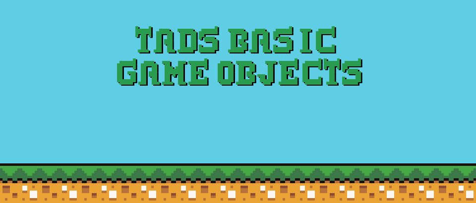

# Tabageos:   Tads Basic Game Objects



A library and tools for making 2D and isometric games and applications.


## Easy setup
Use jsdelivr cdn or download and include tbgs_min.js, ControllerPad.js, and ControllerPad.css in the html.

```html
<html>
	<head><title>Quick Platformer</title>
		<script type="text/javascript" src="https://cdn.jsdelivr.net/gh/tabageos/tabageos/tbgs_min.js"></script>
        <script type="text/javascript" src="https://cdn.jsdelivr.net/gh/tabageos/tabageos/ControllerPad.js"></script>
        <link rel="stylesheet" type="text/css" href="https://cdn.jsdelivr.net/gh/tabageos/tabageos/ControllerPad.css">
	</head>
	<body>
        
        <div id="container" style="position:relative;width:168x;">
			<div id="root" style="position:relative;width:168px;height:144px;top:0px;left:0px;"> </div>
            <div id="controller" > </div>
        </div>
        <script type="text/javascript">
        (function() {
            let scene = [
                [1,1,1,1,1,1,1,1,1,1,1,1,1,1,1,1,1,1,1,1,1],
                [1,0,0,0,0,0,0,0,0,0,0,0,0,0,0,0,0,0,0,0,1],
                [1,0,0,0,0,0,0,0,0,0,0,0,0,0,0,0,0,0,0,0,1],
                [1,0,0,0,0,0,0,0,0,1,0,0,1,0,0,0,0,0,0,0,1],
                [1,2,2,2,0,0,0,0,0,1,0,0,1,0,0,0,0,2,2,2,1],
                [1,0,0,0,0,0,0,0,0,1,0,0,1,0,0,0,0,0,0,0,1],
                [1,0,0,0,0,0,0,0,0,1,0,0,1,0,0,0,0,0,0,0,1],
                [1,0,0,0,0,0,0,0,0,1,0,0,1,0,0,0,0,0,0,0,1],
                [1,1,1,1,1,1,1,1,1,1,1,1,1,1,1,1,1,1,1,1,1]
            ];
           class QuickGame extends tabageos.GameSkeleton {
               constructor() {
 	               super();
 	               var specs = {gWidth:336, gHeight:144, controllerDivId:"controller", gameScale:0, gameLoop:this.loop, initializationSpecifics:this.setup}
 	               this.initialConstruction(specs);
                }
                setup = function() {
 	                this.player = new tabageos.BasicNinja(16,32,16,16, scene,null,1,0,16,16,scene.length,scene[0].length,0);
 	                this.player._directCanvasObject = this.charLayer;
 	                this.player._autoAnimate = 1;
 	                this._cameraType = 1;
 	                tabageos.BlitMath.drawSquaresFromPattern(this.display, scene, 16, 16, {1:"#6495ed",0:"#FFFFFF", 2:"#212121"});
 	                this.removeHUD();
                }
                loop = function(ts) {
 	                this.player.move(this.controller.buttons.left,this.controller.buttons.right, dthis.controller.buttons.up || this.controller.buttons.a, this.controller.buttons.down);
                }
            }
            new QuickGame();
            
        })();
        </script>
    </body>
</html>
```
## ControllerPad Class handling keyboard, touch and gamepad input

The ControllerPad Class is setup to capture keyboard touch and usb gamepad inputs

## GameSkeleton framework Class taking care of many common redundencies

The GameSkeleton Class utilizes the ControllerPad and other Classes of the library for you
to establish the basic setup for any game, 
including title screen, game over screen, a hud, a sound system, lighting and pixel font typing.
By extending the GameSkeleton class you can get straight to the heart of your games code
without having to setup those basic things.

Alternatively you can create your own systems using the individual Classes of the library.

## Easy pixel typing

Via the GameSkeleton Class the pixelType and animatePixelType and related methods are available.
There are eight built in pixel fonts ready to be used, and you can also include your own custom pixel font.
By extending the GameSkeleton Class you can then call pixelType during the game loop to type pixel text to the screen, there is also pixelDialogBox.

## Sprite sheet security
Using the tabageos.loadSpriteSheetAndStart method
you can streamline the loading of your sprite sheet for added security.
Streamlined sprite sheets do not show up in a browsers developer tools.

## No Webgl:
Tad's Basic Game Objects does not use webgl, 
instead in GameSkeleton an optional WebWorker keeping the main loop running 
is used to increase performance.
As such games work on many various devices and run fast.
Because the library is genearlly a collection of individual classes you can create your own main loop system and still utilize the classes.

## Extensive example library

[Example Library](https://www.tabageos.com/examples) 

Includes various examples from each Class, mini games and complete games.

examples current version 1.7


## Documentation for each Class

[Tabageos Documentation](https://www.tabageos.com/docs) 

docs current version 1.0

## Open Source Complete Games
[Adventures In Tmenya](https://www.github.com/tabageos/tabageos/AdventuresInTmenya) 

[Robot Street Ultra Upgrades](https://www.github.com/tabageos/tabageos/RobotStreetUltraUpgrades)


## News and Updates

December 2024  Tabageos updated to version 1.672

	
## License

MIT License.
	
Current Release 1.672